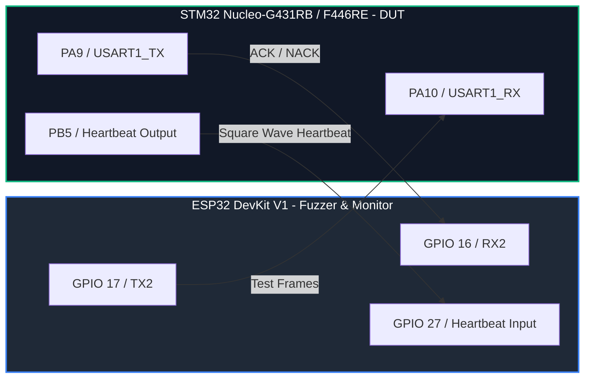

# AutoFuzzer

**AutoFuzzer** is a low-cost, board-to-board robustness testing framework for embedded communication handlers. 

By utilizing an **ESP32** as the fuzzer/health monitor and an **STM32** (e.g., Nucleo) as the Device Under Test (DUT), AutoFuzzer automatically generates and transmits normal, boundary, malformed, and mutated packets. It monitors the DUT's liveness in real-time via a hardware heartbeat pin to catch lockups and crashes, logging precise packet state (RNG seed, sequence, mutation type) for deterministic bug reproduction.

---

## System Architecture



---

## Key Features

- **Multi-Mutation Fuzzing**: Supports seven distinct packet fuzzing strategies (Valid, Empty, Maximum Payload, Overlength, Bad Checksum, Truncated, and Pseudo-Random).
- **Hardware Heartbeat Monitor**: Detects target firmware lockups and interrupts within a configurable threshold (default: 350 ms).
- **Deterministic Replication**: Leverages a custom 32-bit Xorshift PRNG initialized with a deterministic seed (`0xC0DEC0DE`) to allow easy, 1-to-1 replay of crashes.
- **Robust Parser Reference**: Includes a fully robust parser implementation for STM32 featuring packet timeouts (30 ms) and input length validation to prevent parser wedging.
- **Future Protocol Readiness**: Designed to extend beyond UART to SPI, I2C, and CAN.

---

## Hardware Setup (Milestone 1: UART)

Before powering or flashing either board, make sure the logical signals are connected as follows. **Both boards run at 3.3V logic; do not connect external 5V modules directly to GPIO pins.**

| ESP32 Pin | STM32 Nucleo Pin | Signal Direction | Description |
| :--- | :--- | :--- | :--- |
| **GND** | **GND** | $\longleftrightarrow$ | Common ground reference |
| **GPIO 17 (TX2)** | **PA10 (USART1_RX)** | $\longrightarrow$ | Fuzzer output to DUT input |
| **GPIO 16 (RX2)** | **PA9 (USART1_TX)** | $\longleftarrow$ | DUT response to fuzzer |
| **GPIO 27** | **PB5** | $\longleftarrow$ | Heartbeat signal (100 ms toggles) |

*For more details on future protocol expansions (SPI, I2C, CAN), refer to [docs/wiring.md](./docs/wiring.md).*

---

## Communication Protocol & Frame Format

Every message conforms to the following byte format, defined in [docs/protocol.md](./docs/protocol.md):

```
+------+---------+--------+--------+--------+--------------------+-----------+
| SYNC | COMMAND | LENGTH | SEQ_LO | SEQ_HI | PAYLOAD[0..n-1]    | XOR_CHECK |
| 0xA5 |  0x01   |   n    |  0x..  |  0x..  |   ..               |   0x..    |
+------+---------+--------+--------+--------+--------------------+-----------+
```
- `XOR_CHECK` is calculated by XORing all bytes starting from `COMMAND` through the final payload byte.
- The reference STM32 DUT limits the payload size to **32 bytes**.

### Target Responses
When the DUT receives a packet, it replies with:
```
+---------+--------+--------+--------+
| ACK_SYN | SEQ_LO | SEQ_HI | STATUS |
|  0x5A   |  0x..  |  0x..  |  0x..  |
+---------+--------+--------+--------+
```
* **`0x00` (ACK)**: Packet processed successfully.
* **`0x02` (NACK - Overlength)**: Declared length exceeded 32 bytes.
* **`0x03` (NACK - Checksum Error)**: Received checksum did not match calculated checksum.
* **No Response**: If the packet is truncated, the STM32 parser times out after 30 ms and resets without responding.

---

## Quick Start Guide

This project is configured using **PlatformIO**.

### 1. Build and Flash STM32 (DUT)
Connect your STM32 Nucleo board via USB and run:
```bash
cd firmware/stm32
pio run --target upload
```

### 2. Build and Flash ESP32 (Fuzzer)
Disconnect the STM32, connect the ESP32 board, and run:
```bash
cd firmware/esp32
pio run --target upload
```

### 3. Read Fuzz Logs
Open your preferred serial monitor (e.g., PlatformIO serial monitor) connected to the ESP32 at **115200** baud:
```bash
pio device monitor -b 115200
```

You will see output logs indicating the sent mutation type, sequence number, RNG seed, and the corresponding response from the STM32:
```text
AutoFuzzer ESP32: UART baseline ready
TX seq=0 type=valid seed=0020BEEF bytes=A5 01 04 00 00 F2 8A 91 AA 38
DUT seq=0 status=0x00
TX seq=1 type=overlength seed=029A8CEE bytes=A5 01 24 01 00 F2 8A 91 AA C0
DUT seq=1 status=0x02
```

If the heartbeat pin stops toggling, the ESP32 will output a failure report:
```text
FAIL heartbeat-timeout after 351 ms; pause and record last sequence=42
```
To reproduce the crash, re-run the fuzzer using the logged **seed** and **sequence** to re-generate the exact fault-inducing frame.

---

## Repository Layout

- `firmware/esp32`: PlatformIO project for the ESP32 fuzzer and monitor.
- `firmware/stm32`: PlatformIO project for the robust STM32 target parser.
- `docs/wiring.md`: Step-by-step wiring guide for Milestone 1 and future buses.
- `docs/protocol.md`: Technical frame layout and validation rules.

---

## Future Roadmap (AutoFuzzer-AI)

We aim to expand AutoFuzzer into an intelligent testing assistant:
1. **Adaptive Packet Mutation**: An reinforcement learning loop on the ESP32 to learn which byte flips are most likely to lock up the target.
2. **TinyML Crash Prediction**: A lightweight predictor running on the ESP32 to evaluate heartbeat timing jitter and forecast crashes before they occur.
3. **SPI / I2C / CAN Transports**: Full physical bus multiplexing as defined in the layout.
