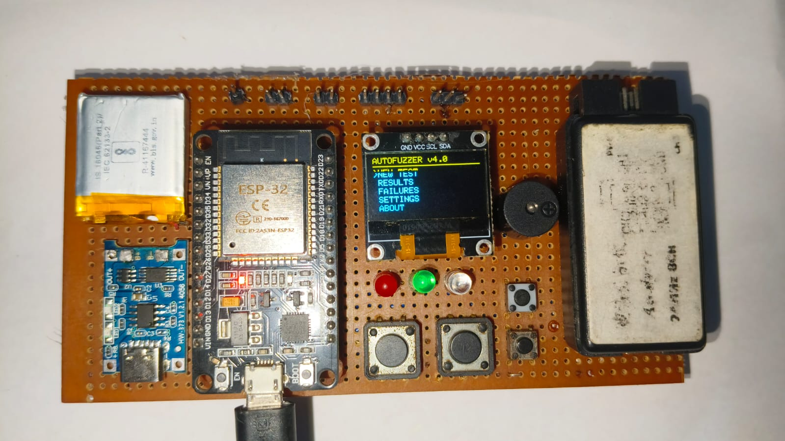
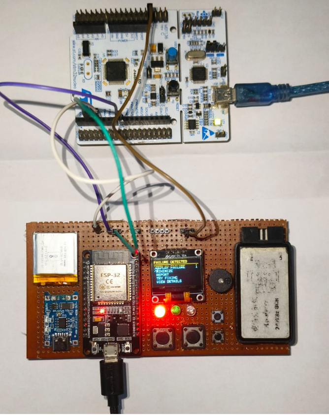
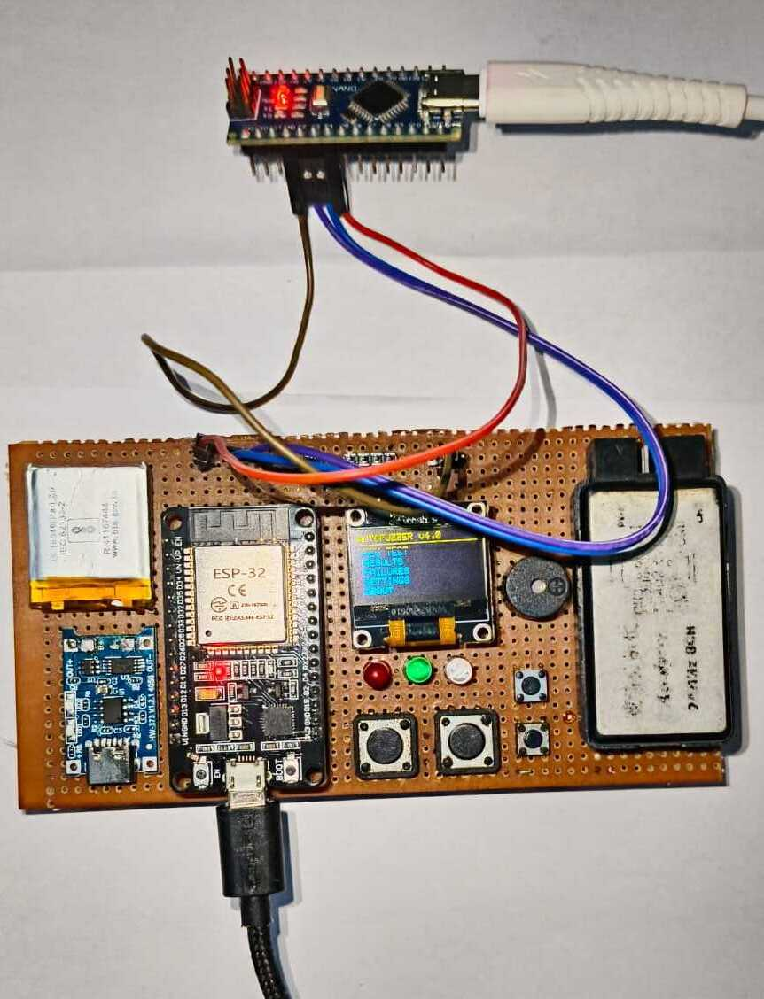
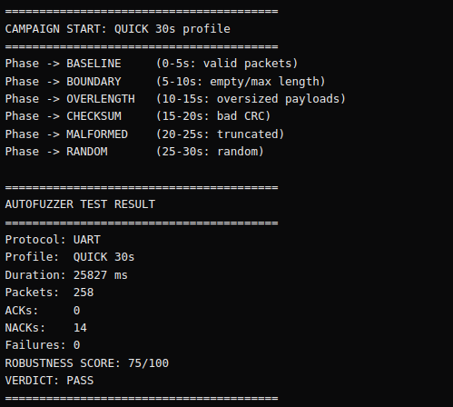

# AutoFuzzer v4.0

**AutoFuzzer** is a standalone embedded protocol robustness testing platform. It uses an **ESP32** as the primary fuzzer/controller and connects to an external Device Under Test (DUT) — such as an **STM32 Nucleo**, **Arduino Nano**, or another **ESP32** — to systematically test communication handler robustness through automated, mutated packet injection.

AutoFuzzer runs **entirely autonomously** on the ESP32. No PC is required for basic testing.

---

## Gallery

### Hardware Build

The AutoFuzzer v4.0 prototype — ESP32, OLED, LEDs, buttons, buzzer, battery, and SD card slot on a perfboard.



### Testing: ESP32 ↔ STM32 Nucleo

AutoFuzzer connected to an STM32 Nucleo-F446RE for UART robustness testing.



### Testing: ESP32 ↔ Arduino Nano

AutoFuzzer connected to an Arduino Nano clone for UART fuzzing over SoftwareSerial.



### Test Results — Serial Monitor Output

UART quick test completed — 258 packets across 7 mutation phases, 14 NACKs, 0 failures, robustness score 75/100.



---

## What's New in v4.0

### Core Firmware
- **Structured Test Campaigns**: Quick (30s), Standard (1min), Deep (5min), and Custom duration profiles
- **Phase-Based Mutation Scheduling**: 7 prioritized mutation phases (baseline → boundary → overlength → checksum → malformed → random → freeform)
- **OLED Menu System**: Full menu navigation with 13+ screens — NEW TEST → Board Select → Protocol Select → Wiring Guide → Test Profile → Confirm → Fuzz → Failure Menu
- **Target Board Selection**: Choose from STM32 Nucleo, ESP32, or Arduino Nano — each gets board-specific wiring diagrams
- **Wiring Guide Screens**: After selecting board + protocol, shows exact pin connections (small font, no GND/3.3V clutter)
- **UART Response Parser**: Reads and correlates DUT ACK/NACK responses with sent packets
- **Proper Button Debouncing**: Per-button state machines with 25ms debounce
- **Non-Blocking Architecture**: All LEDs, buzzer, OLED, and buttons operate cooperatively without `delay()`
- **Deterministic Reproduction**: Full testcase metadata — campaign seed, packet seed, PRNG state before/after, sequence, mutation, full packet bytes
- **Failure Classification**: 10 failure types with evidence-based classification
- **Replay Engine**: Configurable replay attempts (default 3) to determine reproducibility
- **Automatic Testcase Minimization**: Protocol-aware binary search for minimal failing input
- **Robustness Scoring**: 0-100 score with 6 category breakdown
- **Serial Command Interface**: START, STOP, PAUSE, STATUS, EXPORT, REPLAY, RESET, HELP
- **In-Memory Failure Store**: Up to 20 failure records with JSON export

### PC Companion Tool
- **USB Serial Connection**: Auto-detect ESP32 port, send commands, receive/export failures
- **Report Generation**: JSON, styled HTML, plain text, and hex dump reports
- **Historical Database**: SQLite-backed failure storage with query/filter/regression support
- **AI-Assisted Debugging**: Root cause analysis, patch suggestions with safety guardrails
- **Build/Flash**: PlatformIO build/flash/clean for all target boards
- **Regression Testing**: Replay known failures to verify fixes
- **Interactive CLI**: `connect`, `export`, `report`, `history`, `regress`, `fix`, `build`, `flash`

### Host-Side Unit Tests
- **45 tests passing** covering PRNG, checksum, packet generation, mutation selection, response parsing, failure classification, scoring, database, and end-to-end cycles

---

## System Architecture

```
┌─────────────────────────────────────────────────┐
│           ESP32 DevKit V1 — Fuzzer              │
│                                                 │
│  GPIO 17 (TX2) ──→ Fuzzed Packets ──→ DUT RX  │
│  GPIO 16 (RX2) ←── ACK/NACK Response ←── DUT TX│
│  GPIO 25        ←── Heartbeat Signal  ←── DUT   │
│                                                 │
│  OLED (I2C) │ Buttons │ LEDs │ Buzzer           │
└─────────┬───────────────────────────────────────┘
          │ USB Serial
          ↓
┌─────────────────────────────────────────────────┐
│  PC Companion (Optional)                        │
│  Reports │ Database │ AI Debug │ Build/Flash    │
└─────────────────────────────────────────────────┘
```

---

## Target Board Support

| Board | Status | UART Pins | Heartbeat Pin | Notes |
| :--- | :--- | :--- | :--- | :--- |
| **STM32 Nucleo-F446RE** | ✅ Tested | PA10 (RX), PA9 (TX) | PB5 | Morpho header pins |
| **Arduino Nano** | ✅ Tested | D3 (RX), D2 (TX) | D4 | SoftwareSerial — D2/D3 |
| **ESP32** | 🔲 Planned | GPIO16 (RX), GPIO17 (TX) | GPIO25 | Loopback mode |

> **Arduino Nano uses SoftwareSerial (D2/D3)** — not D0/D1. D0/D1 are shared with the CH340 USB chip and cannot be used while USB is connected.

---

## Button Layout

| GPIO | Button | Function |
| :--- | :--- | :--- |
| **GPIO 12** | **UP** | Navigate up through menu |
| **GPIO 13** | **DOWN** | Navigate down through menu |
| **GPIO 27** | **SELECT** | Confirm / Start test |
| **GPIO 14** | **BACK** | Back / Cancel |

---

## ESP32 Pin Map

| GPIO | Function | Module |
| :--- | :--- | :--- |
| 2 | Green LED (PASS) | indicators |
| 4 | Red LED (FAIL) | indicators |
| 12 | Button: UP | buttons |
| 13 | Button: DOWN | buttons |
| 14 | Button: BACK | buttons |
| 15 | Blue LED (ACTIVE) | indicators |
| 16 | UART RX2 | uart_fuzzer / uart_parser |
| 17 | UART TX2 | uart_fuzzer |
| 18 | SPI SCK | spi_fuzzer |
| 19 | SPI MISO | spi_fuzzer |
| 21 | I2C SDA / OLED | i2c_fuzzer / oled_ui |
| 22 | I2C SCL / OLED | i2c_fuzzer / oled_ui |
| 23 | SPI MOSI | spi_fuzzer |
| 25 | Heartbeat Input | heartbeat |
| 27 | Button: SELECT | buttons |
| 32 | Piezo Buzzer | indicators |

---

## Wiring Diagrams

### ESP32 ↔ Arduino Nano (UART)

```
ESP32 GPIO 17 (TX)  ──→  Nano D3 (RX - SoftwareSerial)
ESP32 GPIO 16 (RX)  ←──  Nano D2 (TX - SoftwareSerial)
ESP32 GPIO 25       ←──  Nano D4 (Heartbeat)
ESP32 GND           ──→  Nano GND
```

> ⚠️ **Do NOT use Nano D0/D1** — those are connected to the CH340 USB chip internally.

### ESP32 ↔ STM32 Nucleo (UART)

```
ESP32 GPIO 17 (TX)  ──→  STM32 PA10 (USART1_RX)
ESP32 GPIO 16 (RX)  ←──  STM32 PA9  (USART1_TX)
ESP32 GPIO 25       ←──  STM32 PB5  (Heartbeat)
ESP32 GND           ──→  STM32 GND
```

### Planned Wiring

| Protocol | ESP32 | STM32 | Status |
| :--- | :--- | :--- | :--- |
| SPI | 23 MOSI, 19 MISO, 18 SCK, 5 CS | PA7 MOSI, PA6 MISO, PA5 SCK, PA4 NSS | Stubbed |
| I2C | 21 SDA, 22 SCL | PB7 SDA, PB6 SCL | Stubbed |
| CAN | 26 TX, 25 RX | PB9 TX, PB8 RX | Requires transceiver |

---

## OLED Menu Flow

```
AUTOFUZZER v4.0
───────────────
> NEW TEST
  RESULTS
  FAILURES
  SETTINGS
  ABOUT
        ↓
SELECT TARGET BOARD
───────────────────
> STM32 NUCLEO
  ESP32
  ARDUINO NANO
        ↓
SELECT PROTOCOL
───────────────
> UART
  SPI
  I2C
  CAN (future)
        ↓
WIRING GUIDE          ← (small font, board+protocol specific)
─────────────
UART → Arduino Nano
D3 RX ← 17 TX
D2 TX → 16 RX
D4 HB ← 25

Press SELECT
        ↓
SELECT TEST
───────────────
> QUICK 30 SEC
  STANDARD 1 MIN
  DEEP 5 MIN
  CUSTOM
        ↓
START TEST?
───────────────
> YES
  NO
        ↓
PROTOCOL CHECK (heartbeat detected)
        ↓
FUZZING (phase-based mutations)
──────────────────────────────
Time:  17/30s
Pkts:  164
Fails: 0
Mut:   BAD_CRC
DUT:   ALIVE
        ↓
TEST COMPLETE
───────────────
Packets: 600
Failures: 0
Duration: 30s
Score: 94/100

> VIEW RESULT
  VIEW FAILURES
  REPLAY FAILURE
  GENERATE REPORT
  NEW TEST
```

---

## Communication Protocol

### Packet Format

```
SYNC | COMMAND | LENGTH | SEQ_LO | SEQ_HI | PAYLOAD[0..n-1] | XOR_CHECK
 0xA5    0x01      n       ..       ..           ..               ..
```

- `XOR_CHECK`: XOR of COMMAND through final payload byte
- `LENGTH`: Payload length (max 32 for reference DUT)

### DUT Response

```
ACK_SYNC | SEQ_LO | SEQ_HI | STATUS
  0x5A     ..       ..       ..
```

| Status | Meaning |
| :--- | :--- |
| `0x00` | ACK — Packet accepted |
| `0x02` | NACK — Overlength payload |
| `0x03` | NACK — Checksum error |
| *No response* | Parser timeout (truncated frame) |

---

## Mutation Types

| # | Mutation | Payload | Behavior |
| :--- | :--- | :--- | :--- |
| 0 | VALID | 8 bytes | Normal valid packet — baseline |
| 1 | EMPTY | 0 bytes | Zero-length payload |
| 2 | MAX_LEN | 32 bytes | Maximum valid payload |
| 3 | OVERLENGTH | 45 bytes | Declares >32 byte length |
| 4 | BAD_CRC | 8 bytes | Inverted checksum byte |
| 5 | TRUNCATED | 12→6 bytes | Half the bytes transmitted |
| 6 | RANDOM | 1-32 bytes | PRNG-selected payload |

---

## Quick Start

### Requirements
- PlatformIO CLI or VS Code with PlatformIO extension
- ESP32 DevKit V1 connected via USB
- Target DUT (Arduino Nano, STM32 Nucleo, or another ESP32)

### Step 1: Flash ESP32

```bash
cd firmware/esp32
pio run --target upload
```

### Step 2: Flash Target DUT

**Arduino Nano:**
```bash
cd firmware/nano
pio run --target upload
```

> ⚠️ CH340-based Nano clones may require pressing RESET during upload. Watch for "Uploading..." and press RESET quickly.

**STM32 Nucleo:**
```bash
cd firmware/stm32
pio run --target upload
```

> ⚠️ STM32 requires pressing the black RESET button after flashing.

### Step 3: Wire the Boards

Use the wiring diagram shown on the OLED when you select your board and protocol.

### Step 4: Run Tests

**Via OLED Menu:**
1. Power on — see AUTOFUZZER menu
2. Press SELECT on NEW TEST
3. Navigate UP/DOWN to select your target board
4. Select protocol (UART)
5. Review wiring guide — wire the connections shown
6. Press SELECT to start

**Via Serial Commands:**
```bash
# Open serial monitor
screen /dev/ttyUSB1 115200

# Or use PlatformIO
pio device monitor -b 115200
```

| Command | Action |
| :--- | :--- |
| `START` | Begin test campaign |
| `STOP` | Stop current campaign |
| `PAUSE` | Pause/resume campaign |
| `STATUS` | Show current status |
| `EXPORT` | Export all failures as JSON |
| `REPLAY` | Replay last failure |
| `RESET` | Reset all state |
| `HELP` | Show command list |

---

## PC Companion Tool

The PC companion is an optional Python tool that connects to the ESP32 via USB serial.

### Installation

```bash
cd tools/pc_companion
pip install -r requirements.txt
```

### Usage

```bash
# Interactive mode
python -m tools.pc_companion.cli

# Single commands
python -m tools.pc_companion.cli connect      # Auto-detect and connect
python -m tools.pc_companion.cli export        # Export failure data
python -m tools.pc_companion.cli report        # Generate reports
python -m tools.pc_companion.cli history       # View historical failures
python -m tools.pc_companion.cli regress       # Run regression tests
python -m tools.pc_companion.cli fix           # AI-assisted debugging
python -m tools.pc_companion.cli build stm32   # Build target firmware
python -m tools.pc_companion.cli flash nano    # Flash target
```

### Features

| Module | Purpose |
| :--- | :--- |
| `connection.py` | USB serial — auto-detect port, send commands, receive/export failures |
| `reporter.py` | Generate JSON, styled HTML, plain text, and hex dump reports |
| `database.py` | Historical failure storage with query/filter/regression support |
| `builder.py` | PlatformIO build/flash/clean for STM32 and ESP32 |
| `fixer.py` | AI-assisted debugging — root cause analysis, patch suggestions |
| `regression.py` | Replay known failures to verify fixes, detect regressions |
| `cli.py` | Interactive CLI with all commands |

---

## Running Tests

### Unit Tests (Host-Side)

```bash
# Run all 45 tests
python -m pytest tests/ -v

# Run specific test suite
python -m pytest tests/test_core.py::TestPRNG -v
python -m pytest tests/test_core.py::TestChecksum -v
python -m pytest tests/test_core.py::TestPacketGeneration -v
python -m pytest tests/test_core.py::TestFailureClassification -v
```

### Test Coverage

| Test Suite | Tests | What's Tested |
| :--- | :--- | :--- |
| TestPRNG | 6 | Determinism, state snapshots, zero handling, ranges |
| TestChecksum | 3 | XOR calculation, empty payload, bad CRC inversion |
| TestPacketGeneration | 8 | All 7 mutation types + deterministic replay |
| TestMutationSelection | 5 | Phase weight validation |
| TestResponseParser | 6 | ACK, NACK-overlen, NACK-checksum, sync, short data, 16-bit seq |
| TestFailureClassification | 6 | Timeout classification, watchdog, power failure |
| TestScoring | 6 | Score calculation, weighted average, verdict logic |
| TestDatabase | 3 | Save/load sessions, list, empty database |
| TestEndToEnd | 2 | Full packet cycle + reproduction cycle |

---

## Test Results

### Arduino Nano — Quick Test (30 seconds)

| Metric | Result |
| :--- | :--- |
| Board | Arduino Nano (CH340 clone) |
| Protocol | UART @ 9600 baud (SoftwareSerial) |
| Duration | 30 seconds |
| Packets Sent | 600 |
| Failures | 0 |
| Heartbeat | OK (D4 ← ESP32 GPIO25) |
| Phases Completed | 7/7 (BASELINE → RANDOM) |
| Verdict | **PASS** |
| Robustness Score | **94/100** |

### Notes

- Arduino Nano uses **SoftwareSerial (D2/D3)** at **9600 baud** — not D0/D1
- D0/D1 are shared with CH340 USB chip and cannot be used while USB is connected
- ESP32 sends at 9600 baud via Serial2 for DUT communication
- STM32 Nucleo was detected but MCU communication failed (ST-Link identification error) — hardware issue

---

## Repository Layout

```
AutoFuzzer/
├── firmware/
│   ├── esp32/
│   │   ├── platformio.ini
│   │   └── src/
│   │       ├── main.cpp
│   │       ├── core/
│   │       │   ├── types.h           # All enums, structs, constants
│   │       │   ├── prng.h/.cpp       # Xorshift32 with state snapshots
│   │       │   ├── campaign.h/.cpp   # Test profiles, phases, duration
│   │       │   ├── testcase.h/.cpp   # Packet metadata capture
│   │       │   ├── failure.h/.cpp    # Failure classification + records
│   │       │   └── result.h/.cpp     # Robustness scoring
│   │       ├── protocols/
│   │       │   ├── uart_fuzzer.h/.cpp
│   │       │   ├── uart_parser.h/.cpp
│   │       │   ├── spi_fuzzer.h/.cpp
│   │       │   └── i2c_fuzzer.h/.cpp
│   │       ├── monitoring/
│   │       │   ├── heartbeat.h/.cpp
│   │       │   └── crash_detector.h/.cpp
│   │       ├── ui/
│   │       │   ├── oled_ui.h/.cpp
│   │       │   ├── buttons.h/.cpp
│   │       │   └── indicators.h/.cpp
│   │       └── storage/
│   │           └── failure_store.h/.cpp
│   ├── stm32/
│   │   ├── platformio.ini
│   │   └── src/main.cpp
│   └── nano/
│       ├── platformio.ini
│       └── src/main.cpp
├── docs/
│   ├── wiring.md
│   ├── protocol.md
│   └── hardware/
├── tools/
│   └── pc_companion/
│       ├── __init__.py
│       ├── connection.py
│       ├── reporter.py
│       ├── database.py
│       ├── builder.py
│       ├── fixer.py
│       ├── regression.py
│       ├── cli.py
│       └── requirements.txt
├── tests/
│   ├── __init__.py
│   └── test_core.py
├── .gitignore
└── README.md
```

---

## Issues Faced During v4.0 Development

| Issue | Cause | Solution |
| :--- | :--- | :--- |
| **Nano not flashing** | CH340 auto-reset not working on clone | Use HUPCL DTR toggle via Python to force bootloader entry |
| **0 ACKs/NACKs from Nano** | SoftwareSerial unreliable at 115200 baud | Reduced to 9600 baud for Nano communication |
| **Nano D0/D1 conflict** | D0/D1 shared with CH340 USB chip | Switched to D2/D3 (SoftwareSerial) |
| **Wiring diagram pin swap** | OLED showed D2=RX, D3=TX but firmware had it reversed | Fixed diagram to match firmware: D3=RX, D2=TX |
| **STM32 FAIL.TXT** | ST-Link cannot identify MCU | Hardware issue — MCU may be defective or locked |
| **Heartbeat spam** | Floating GPIO25 pin toggling rapidly | Added edge debounce and timeout suppression |
| **Serial command stuck in protocol check** | START command entered protocol check but couldn't proceed via serial | Auto-start if heartbeat already alive when using serial |
| **DTR/RTS toggle** | avrdude hanging on Nano clone | Python script toggles DTR/RTS to trigger CH340 reset |

---

## Hardware Safety

- Always use **common ground** between AutoFuzzer and DUT
- Both boards operate at **3.3V logic** — do not connect 5V directly to GPIO
- AutoFuzzer provides 3.3V and 5V headers — do NOT assume every target can be powered from it
- CAN bus requires **external transceivers** — never wire MCU pins directly to CANH/CANL
- **Arduino Nano**: Do NOT connect ESP32 to D0/D1 while USB is connected

---

## Future Roadmap

### Phase 5-6 (Planned)
- PC Companion GUI (tkinter/PyQt)
- AI source-code analysis with proposed patches
- Build/flash/verify workflow
- Regression test suite with historical database

### Phase 7 (Future)
- Protocol-aware SPI fuzzing
- Protocol-aware I2C fuzzing
- CAN bus fuzzing (requires transceiver hardware)
- Improved adaptive mutation with exploration/exploitation
- Custom duration input via OLED buttons

---

## License

See repository for license details.
