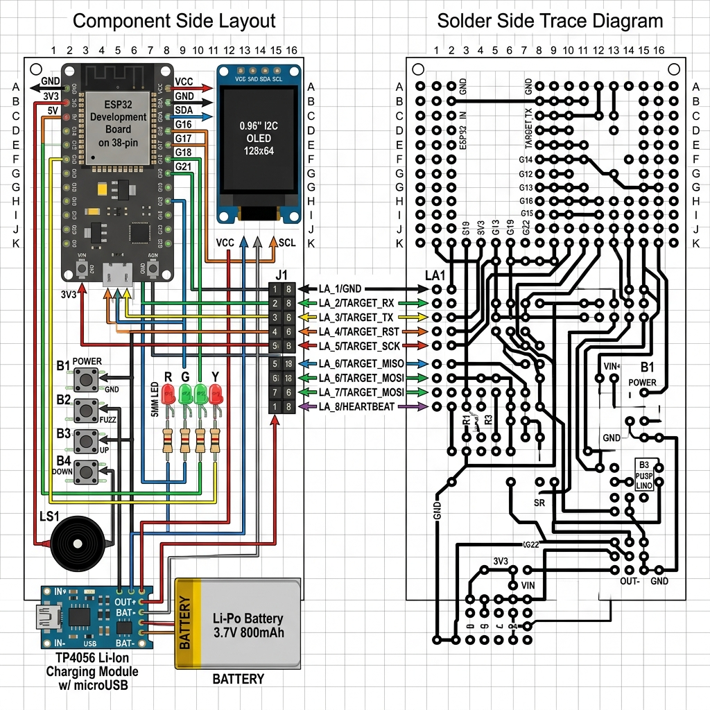
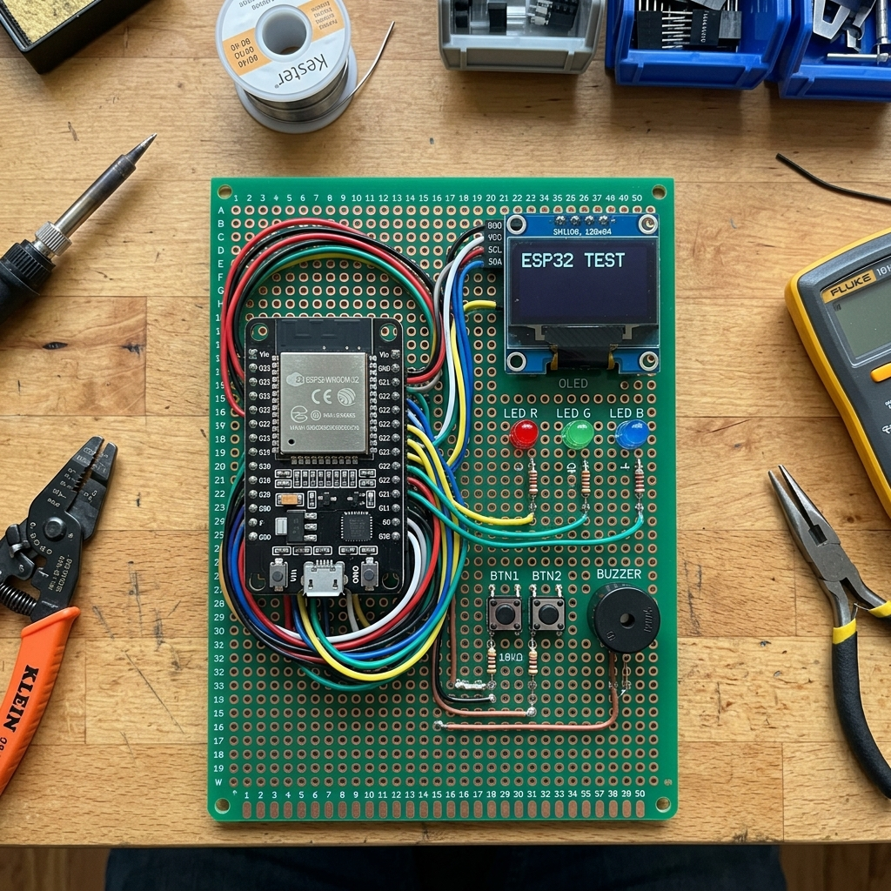

# AutoFuzzer Dot Board Layout and Wiring Guide

````carousel

<!-- slide -->

````

This document provides a complete layout and step-by-step trace wiring guide to build your AutoFuzzer prototype on a standard **30 x 20 hole copper dot board**.

---

## 1. Physical Grid Coordinate Mapping (Front View)

The board layout is mapped on a grid where:
* **Rows**: A to T (top to bottom, 20 rows)
* **Columns**: 1 to 30 (left to right, 30 columns)

```text
       1   2   3   4   5   6   7   8   9  10  11  12  13  14  15  16  17  18  19  20  21  22  23  24  25  26  27  28  29  30
   A [ .   .   .   .   .   .   .   .   .   .   .   .   .   .   .   .   .   .   . [VCC GND SCL SDA] (OLED MODULE)    .   . ] A
   B [ .   .   .   .   .   .   .[ G_LED ]  .  .[ R_LED ]  .  .[ B_LED ]  .   .   .   .   .   .   .   .   .   .   .   .   . ] B
   C [ .   .   .   . [3V3] .   .   .   .   .   .   .   . [ EN] .   .   .   .   .   .   .   .   .   .   .   .   .   .   .   . ] C
   D [ .   .   .   . [GND] .   .   .   .   .   .   .   . [ VP] .   .   .   .   .   .   .   .   .   .   .   .   .   . [GND] ] D (P1)
   E [ .   .   .   . [D15] .   .   .   .   .   .   .   . [ VN] .   .   .   .   .   .   .   .   .   .   .   .   .   . [3V3] ] E (P2)
   F [ .   .   .   . [ D2] .   .   .   .   .   .   .   . [D34] .   .   .   .   .   .   .   .   .   .   .   .   .   . [ 5V] ] F (P3)
   G [ .   .   .   . [ D4] .   .   .   .   .   .   .   . [D35] .   .   .   .   .   .   .   .   .   .   .   .   .   . [ TX] ] G (P4)
   H [ .   .   .   . [RX2] .   .   .   .   .   .   .   . [D32] .   .[BTN1- SEL] .   .   .   .   .   .   .   .   . [ RX] ] H (P5)
   I [ .   .   .   . [TX2] .   .   .   .   .   .   .   . [D33] .   .   .   .   .   .   .   .   .   .   .   .   .   . [SCK] ] I (P6)
   J [ .   .   .   . [ D5] .   .   .   .   .   .   .   . [D25] .   .   .   .   .   .   .   .   .   .   .   .   .   . [MSO] ] J (P7)
   K [ .   .   .   . [D18] .   .   .   .   .   .   .   . [D26] .   .[BTN2- RST] .   .   .   .   .   .   .   .   . [MSI] ] K (P8)
   L [ .   .   .   . [D19] .   .   .   .   .   .   .   . [D27] .   .   .   .   .   .   .   .   .   .   .   .   .   . [ CS] ] L (P9)
   M [ .   .   .   . [D21] .   .   .   .   .   .   .   . [D14] .   .   .   .   .   .   .   .   .   .   .   .   .   . [SDA] ] M (P10)
   N [ .   .   .   . [RX0] .   .   .   .   .   .   .   . [D12] .   .[BUZZER + -].   .   .   .   .   .   .   .   . [SCL] ] N (P11)
   O [ .   .   .   . [TX0] .   .   .   .   .   .   .   . [D13] .   .   .   .   .   .   .   .   .   .   .   .   .   . [ HB] ] O (P12)
   P [ .   .   .   . [D22] .   .   .   .   .   .   .   . [GND] .   .   .   .   .   .   .   .   .   .   .   .   .   .   .   . ] P
   Q [ .   .   .   . [D23] .   .   .   .   .   .   .   . [VIN] .   .   .   .   .   .   .   .   .   .   .   .   .   .   .   . ] Q
   R [ .   .   .   .   .   .   .   .   .   .   .   .   .   .   .   .   .   .   . [3V3 GND TXD RXD] (CAN TRANSCEIVER)  . ] R
   S [ .   .   .   .   .   .   .   .   .   .   .   .   .   .   .   .   .   .   .   .   .   .   .   .   .   .   .   .   .   . ] S
   T [ .   .   .   .   .   .   .   .   .   .   .   .   .   .   .   .   .   .   .   .   .   .   .   .   .   .   .   .   .   . ] T
```

---

## 2. Component Pin Coordinate Details

| Component | Grid Location (Pins) | Label / Pin Name | Description |
| :--- | :--- | :--- | :--- |
| **ESP32 DevKit** | Column 5, Rows C to Q | Left Row of ESP32 | Standard 15-pin header |
| | Column 14, Rows C to Q | Right Row of ESP32 | Standard 15-pin header |
| **OLED Display** | Row A, Columns 20 to 23 | `VCC, GND, SCL, SDA` | Plug-in OLED Module |
| **CAN Transceiver**| Row R, Columns 20 to 23 | `3V3, GND, TXD, RXD` | SN65HVD230 Breakout Module |
| **Select Button** | Row H, Columns 16 & 17 | `Pin 1, Pin 2` | Navigation/Select button |
| **Reset Button** | Row K, Columns 16 & 17 | `Pin 1, Pin 2` | Reset/Pause button |
| **Green LED** | Row B, Columns 8 & 9 | `Anode (+), Cathode (-)`| Pass/Heartbeat Status LED |
| **Red LED** | Row B, Columns 11 & 12 | `Anode (+), Cathode (-)`| Fail/Crash Status LED |
| **Blue LED** | Row B, Columns 14 & 15 | `Anode (+), Cathode (-)`| Packet Active Status LED |
| **Piezo Buzzer** | Row N, Columns 16 & 17 | `Positive (+), Negative (-)` | 5V Active Alert Buzzer |
| **12-Pin Header** | Column 30, Rows D to O | `Pins 1 to 12` | Main target testing header |

---

## 3. Back-Side Trace Connections (Copper Routing List)

Follow these direct point-to-point connections on the back (solder side) of the dot board. Use wrapping wire or solder bridges:

### Power Bus (3.3V)
* Connect **ESP32 3V3** `(C, 5)` to:
  * **OLED VCC** `(A, 20)`
  * **CAN Transceiver 3V3** `(R, 20)`
  * **12-Pin Header Pin 2** `(E, 30)`

### Power Bus (5V / VIN)
* Connect **ESP32 VIN** `(Q, 14)` to:
  * **12-Pin Header Pin 3** `(F, 30)`

### Common Ground (GND)
* Connect **ESP32 GND** `(D, 5)` and `(P, 14)` to:
  * **OLED GND** `(A, 21)`
  * **CAN Transceiver GND** `(R, 21)`
  * **Select Button Pin 2** `(H, 18)`
  * **Reset Button Pin 2** `(K, 18)`
  * **Buzzer Negative (-)** `(N, 18)`
  * **Green LED Cathode (-)** `(B, 9)`
  * **Red LED Cathode (-)** `(B, 12)`
  * **Blue LED Cathode (-)** `(B, 15)`
  * **12-Pin Header Pin 1** `(D, 30)`

### Display Interface (I2C)
* Connect **ESP32 D21 (SDA)** `(M, 5)` $\longrightarrow$ **OLED SDA** `(A, 23)`
* Connect **ESP32 D22 (SCL)** `(P, 5)` $\longrightarrow$ **OLED SCL** `(A, 22)`
* *(Note: Route traces from the same ESP32 pins to target Header Pins 10 & 11 for testing external I2C targets).*

### CAN Transceiver Interface
* Connect **ESP32 D25 (CAN_TX)** `(J, 14)` $\longrightarrow$ **CAN Transceiver TXD** `(R, 22)`
* Connect **ESP32 D26 (CAN_RX)** `(K, 14)` $\longrightarrow$ **CAN Transceiver RXD** `(R, 23)`
* *(Expose `CAN_H` and `CAN_L` from the breakout board directly to Header Pins 10 & 11 or a separate 2-pin block).*

### UI Inputs and Outputs
* **Select Button**: Connect **ESP32 D12** `(N, 14)` $\longrightarrow$ **Select Button Pin 1** `(H, 17)`
* **Reset Button**: Connect **ESP32 D13** `(O, 14)` $\longrightarrow$ **Reset Button Pin 1** `(K, 17)`
* **Buzzer**: Connect **ESP32 D14** `(M, 14)` $\longrightarrow$ **Buzzer Positive (+)** `(N, 17)`
* **Green LED**: Connect **ESP32 D2** `(F, 5)` $\longrightarrow$ **220 $\Omega$ Resistor** $\longrightarrow$ **Green LED Anode (+)** `(B, 8)`
* **Red LED**: Connect **ESP32 D4** `(G, 5)` $\longrightarrow$ **220 $\Omega$ Resistor** $\longrightarrow$ **Red LED Anode (+)** `(B, 11)`
* **Blue LED**: Connect **ESP32 D15** `(E, 5)` $\longrightarrow$ **220 $\Omega$ Resistor** $\longrightarrow$ **Blue LED Anode (+)** `(B, 14)`

### Target Expose Header Wiring (Column 30)
Run these traces directly from the ESP32 pins to the target output header:
1. **Header Pin 1 (GND)** `(D, 30)` $\longleftrightarrow$ Connected to GND Bus.
2. **Header Pin 2 (3V3)** `(E, 30)` $\longleftrightarrow$ Connected to 3.3V Bus.
3. **Header Pin 3 (5V)** `(F, 30)` $\longleftrightarrow$ Connected to 5V/VIN Bus.
4. **Header Pin 4 (TX2/UART_TX)** `(G, 30)` $\longleftarrow$ Connect to **ESP32 TX2** `(I, 5)`
5. **Header Pin 5 (RX2/UART_RX)** `(H, 30)` $\longleftarrow$ Connect to **ESP32 RX2** `(H, 5)`
6. **Header Pin 6 (SCK/SPI_SCK)** `(I, 30)` $\longleftarrow$ Connect to **ESP32 D18** `(K, 5)`
7. **Header Pin 7 (MISO/SPI_MISO)** `(J, 30)` $\longleftarrow$ Connect to **ESP32 D19** `(L, 5)`
8. **Header Pin 8 (MOSI/SPI_MOSI)** `(K, 30)` $\longleftarrow$ Connect to **ESP32 D23** `(Q, 5)`
9. **Header Pin 9 (CS/SPI_CS)** `(L, 30)` $\longleftarrow$ Connect to **ESP32 D5** `(J, 5)`
10. **Header Pin 10 (SDA/I2C_SDA)** `(M, 30)` $\longleftarrow$ Connect to **ESP32 D21** `(M, 5)`
11. **Header Pin 11 (SCL/I2C_SCL)** `(N, 30)` $\longleftarrow$ Connect to **ESP32 D22** `(P, 5)`
12. **Header Pin 12 (Heartbeat)** `(O, 30)` $\longleftarrow$ Connect to **ESP32 D27** `(L, 14)`
